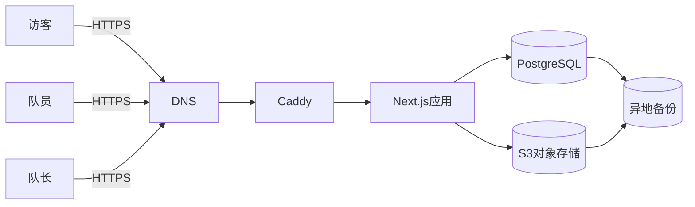
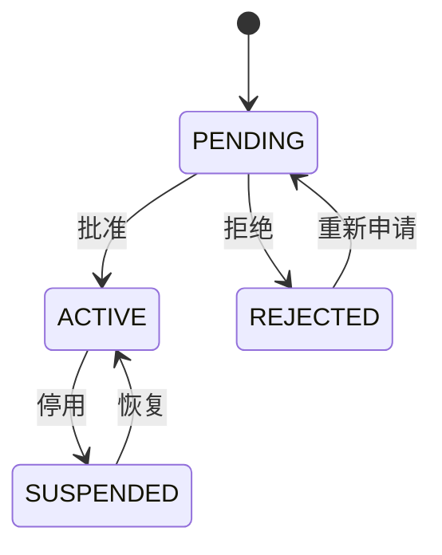
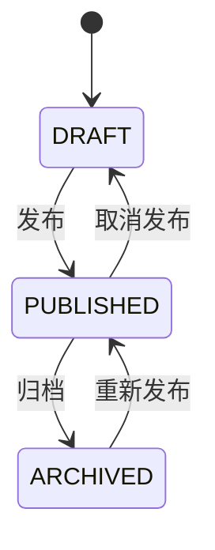
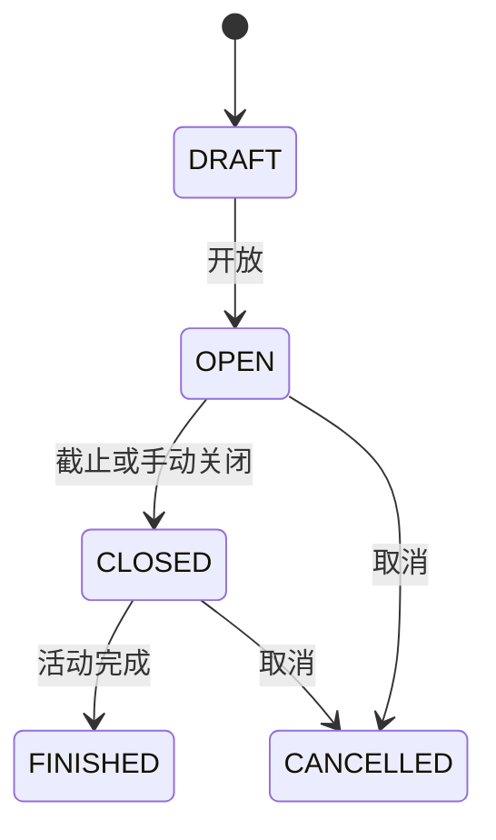

# EIC FC 球队网站完整架构设计

> 状态：实施基线  
> 域名：`czzczzzez.cloud`  
> 目标读者：负责生成代码、测试、部署和维护本项目的开发者或 AI 模型  
> 默认时区：`Asia/Shanghai`  
> 文档版本：1.0

## 1. 项目目标

本项目用于建设一套业余球队官方网站，提供：

1. 公开展示球队动态；
2. 队长创建、编辑、预览、发布、置顶、取消置顶、删除和恢复文章；
3. 已审核队员参加活动接龙；
4. 用户注册、登录和队长审核；
5. 队长管理成员、文章、接龙和审计记录；
6. 在中国大陆云服务器或旧电脑上通过 Docker 部署；
7. 具备最基本的权限控制、安全防护、备份、恢复、日志和自动化测试。

备案和页面用语统一采用“球队动态”或“球队公告”，不把网站描述为互联网新闻服务。网站内容只涉及本球队，不提供社会新闻聚合、公众投稿、论坛或商业交易。

## 2. 首期范围

### 2.1 必须实现

- 响应式首页；
- 球队动态列表和详情；
- Tiptap 富文本编辑器；
- 图片上传、封面和图注；
- 草稿、发布、归档、置顶和软删除；
- 用户名或邮箱加密码登录；
- 注册后等待队长审核；
- 队长批准、拒绝、停用和恢复成员；
- 活动接龙、容量、候补、截止和取消报名；
- 队长后台；
- 审计日志；
- Docker 本地和生产部署；
- PostgreSQL 自动备份与恢复脚本；
- 单元、集成和端到端测试；
- ICP 备案号及公安备案信息展示位置。

### 2.2 首期不实现

- 评论、论坛和私信；
- 付费、商城和广告；
- 短信登录；
- 微信、QQ 等第三方登录；
- 多球队租户系统；
- 自建邮件服务器；
- Kubernetes、微服务、Redis 集群；
- 原生手机 App。

忘记密码首期由队长线下核实后执行管理端重置。后续接入事务邮件时，再增加邮件验证和自助找回密码。

## 3. 技术栈

- Node.js：当前活跃 LTS 版本；
- 包管理器：pnpm，并提交 `pnpm-lock.yaml`；
- Web：Next.js App Router + TypeScript；
- 样式：Tailwind CSS；
- 组件：shadcn/ui；
- 表单：React Hook Form + Zod；
- 数据库：PostgreSQL；
- ORM：Prisma；
- 认证：自研数据库 Cookie 会话（Argon2id + Session HMAC）；
- 密码：Argon2id；
- 富文本：Tiptap/ProseMirror JSON；
- 图片处理：Sharp；
- 对象存储：开发 MinIO，生产腾讯 COS、阿里 OSS 或其他 S3 兼容服务；
- 日志：Pino JSON 日志；
- 单元测试：Vitest + React Testing Library；
- 浏览器测试：Playwright；
- Web 入口：Caddy；
- 容器：Docker Compose；
- CI：GitHub Actions。

不得在没有架构评审的情况下替换认证框架、ORM、数据库或部署方式。不得同时维护 REST 和 GraphQL 两套接口。

## 4. 总体架构



采用模块化单体。页面、服务端渲染、API、认证和业务逻辑位于同一个 Next.js 项目，但必须按领域分层。Route Handler 不直接写复杂业务，所有状态迁移和数据库事务都放在 `src/server`。

### 4.1 请求分层

```text
浏览器
  -> Caddy：TLS、安全响应头、压缩、反向代理
  -> Next.js 页面或 Route Handler
  -> Zod 请求校验
  -> 服务端权限守卫
  -> 领域服务
  -> Prisma 事务
  -> PostgreSQL / S3
```

### 4.2 缓存策略

- 公开文章列表和详情允许使用 Next.js 缓存；
- 发布、取消发布、置顶、删除和恢复后必须执行对应路径的缓存失效；
- 用户、审核、接龙和后台页面不得被公共缓存；
- 不使用缓存保存权限事实；
- 首期不引入 Redis。

## 5. 用户与权限

### 5.1 角色

- `MEMBER`：已审核队员；
- `CAPTAIN`：队长，拥有全部球队管理权限。

未登录用户不存角色。是否可访问系统由用户状态和角色共同决定。

### 5.2 用户状态

- `PENDING`：注册成功，等待队长审核；
- `ACTIVE`：审核通过；
- `REJECTED`：审核拒绝；
- `SUSPENDED`：已停用。

### 5.3 权限规则

- 访客可以阅读已发布且未删除的球队动态；
- PENDING 只能查看审核状态、更新允许修改的个人资料和退出；
- REJECTED 只能查看拒绝原因和退出；
- SUSPENDED 不得创建新会话，已有会话立即失效；
- ACTIVE MEMBER 可以查看接龙、报名、修改或取消自己的报名；
- ACTIVE CAPTAIN 可以管理成员、文章、接龙、媒体和审计记录；
- 前端隐藏按钮不构成权限控制；
- 每次敏感请求都必须从数据库读取当前状态和角色；
- 最后一名 ACTIVE CAPTAIN 不得被停用、删除或降级；
- 用户不得审核自己的注册申请；
- 高风险操作必须记录审计日志。

## 6. 状态机

### 6.1 用户审核



- 拒绝和停用必须填写原因；
- 状态更新使用条件更新或事务，避免两个队长重复审核；
- 恢复后原有业务数据保留；
- 停用时删除该用户的全部会话。

### 6.2 文章



软删除由独立的 `deletedAt` 表示：

- 任意状态都可软删除；
- 删除后自动取消置顶；
- 软删除默认保留 30 天；
- 队长可在保留期内恢复；
- 物理删除由清理脚本执行；
- 只有 PUBLISHED 文章可置顶。

### 6.3 接龙



- CANCELLED 不得重新开放，应复制为新活动；
- 即使定时关闭任务没有运行，报名接口仍需检查截止时间；
- 已有报名的接龙不应直接物理删除。

## 7. 数据模型

所有主键使用 UUID。所有时间字段使用 PostgreSQL `timestamptz` 并以 UTC 写入。界面按 `Asia/Shanghai` 展示。

### 7.1 User

```text
id                  UUID PK
username            varchar(32) unique
usernameNormalized  varchar(32) unique
email               varchar(254) unique
emailNormalized     varchar(254) unique
passwordHash        text
displayName         varchar(50)
avatarAssetId       UUID nullable FK MediaAsset
role                MEMBER | STAFF | CAPTAIN
staffTitle          COACH | VICE_CAPTAIN | MANAGER nullable
permissions         text[]
teamTitle           varchar(50) nullable
signature           varchar(200) nullable
studentId           varchar(32) nullable
fieldPositions      text[]
preferredFoot       LEFT | RIGHT | BOTH nullable
profilePermissions  text[]
status              PENDING | ACTIVE | REJECTED | SUSPENDED
applicationMessage  varchar(500) nullable
reviewReason        varchar(500) nullable
reviewedById        UUID nullable FK User
reviewedAt          timestamptz nullable
lastLoginAt         timestamptz nullable
createdAt           timestamptz
updatedAt           timestamptz
deletedAt           timestamptz nullable
```

要求：

- 用户名只允许字母、数字、下划线和中文，比较时使用规范化字段；
- 邮箱保存原始展示值和小写规范化值；
- 不保存明文密码；
- 默认角色为 MEMBER、状态为 PENDING；
- 头像只能引用 READY 状态的图片；
- `permissions` 为空表示没有后台权限；队长始终拥有全部权限；
- `teamTitle` 只用于展示，不参与授权；
- `profilePermissions` 控制资料字段的查看/编辑，未配置时使用默认公开字段规则。

### 7.1a TeamProfile

单例球队资料，主键固定为 `default`。

```text
id            text PK
name          varchar(80)
subtitle      varchar(80) nullable
contact       varchar(300) nullable
honors        varchar(2000)
summary       varchar(500)
contentJson   jsonb
plainText     text
crestAssetId  UUID nullable FK MediaAsset
version       integer
updatedById   UUID nullable FK User
```

`TeamImage` 保存球队图集。仅队长可编辑；公开 `/team` 可读取。

### 7.2 会话表

自研会话（Cookie 存原始 token，数据库存 HMAC(AUTH_SECRET, token)）：

```text
Session
sessionToken  varchar unique   # HMAC 哈希
userId       UUID FK User
expires      timestamptz index
```

保留 `Account` / `VerificationToken` 表以兼容未来扩展，首期不使用。

### 7.3 Article

```text
id             UUID PK
slug           varchar(180) unique
title          varchar(120)
subtitle       varchar(180) nullable
summary        varchar(300)
contentJson    jsonb
plainText      text
coverAssetId   UUID nullable FK MediaAsset
coverUrl       varchar(2048) nullable   # 外部 https 图床封面（新建推荐）
status         DRAFT | PUBLISHED | ARCHIVED
authorId       UUID FK User
publishedById  UUID nullable FK User
publishedAt    timestamptz nullable
pinnedAt       timestamptz nullable
pinOrder       integer nullable
viewCount      bigint default 0
version        integer default 1
createdAt      timestamptz
updatedAt      timestamptz
deletedAt      timestamptz nullable
deletedById    UUID nullable FK User
```

约束：

- slug 创建后默认不随标题变化；
- PUBLISHED 必须有 `publishedAt`；
- 未发布文章不得设置 `pinnedAt`；
- `version` 用于乐观锁；
- 列表索引为 `(status, pinnedAt, pinOrder, publishedAt)`；
- 浏览量更新不能阻塞文章读取；
- 新建文章封面与正文图片使用外部 `https://` 图床 URL，不在本站存储文章图片；
- 旧版 `coverAssetId` 与 `/api/media/...` 正文图片保留兼容渲染。

### 7.4 MediaAsset

```text
id            UUID PK
storageKey    varchar unique
originalName  varchar(255)
mimeType      varchar(50)
sizeBytes     bigint
width         integer
height        integer
sha256        char(64)
status        UPLOADING | READY | REJECTED | DELETED
uploadedById  UUID FK User
purpose       ARTICLE_COVER | ARTICLE_CONTENT | AVATAR
createdAt     timestamptz
deletedAt     timestamptz nullable
```

媒体不得保存用户提供的任意磁盘路径或 URL。对象 key 由服务端随机生成。

### 7.5 Relay

```text
id                 UUID PK
title              varchar(120)
description        varchar(2000)
eventAt            timestamptz
eventEndsAt        timestamptz nullable
location           varchar(200)
signupDeadline     timestamptz
capacity           integer nullable
waitlistEnabled    boolean default true
status             DRAFT | OPEN | CLOSED | CANCELLED | FINISHED
createdById        UUID FK User
version            integer default 1
createdAt          timestamptz
updatedAt          timestamptz
deletedAt          timestamptz nullable
```

约束：

- `signupDeadline <= eventAt`；
- `eventEndsAt` 为空或大于 `eventAt`；
- `capacity` 为空或大于 0；
- OPEN 前标题、时间、地点和截止时间必须完整；
- 索引为 `(status, eventAt)`。

### 7.6 RelayEntry

```text
id                UUID PK
relayId           UUID FK Relay
userId            UUID FK User
response          JOINED | WAITLISTED | DECLINED
participantCount  integer default 1
companionNames    text[] default '{}'   # 同行人员姓名，数量 = participantCount - 1
note              varchar(300) nullable
createdAt         timestamptz
updatedAt         timestamptz
```

约束：

- `(relayId, userId)` 唯一；
- `participantCount >= 1`；
- `companionNames.length` 必须等于 `participantCount - 1`（仅 JOINED/WAITLISTED 报名时校验）；
- 只有 JOINED 计入正式容量；
- 重复提交使用 upsert；
- 报名、容量校验和候补递补必须处于同一数据库事务。

### 7.7 AuditLog

```text
id            UUID PK
actorId       UUID nullable FK User
action        varchar(80)
resourceType  varchar(50)
resourceId    varchar(100)
before        jsonb nullable
after         jsonb nullable
reason        varchar(500) nullable
requestId     varchar(64)
ipHash        char(64) nullable
userAgent     varchar(300) nullable
createdAt     timestamptz
```

审计表只允许追加。必须过滤密码、密码哈希、Cookie、Token、对象存储密钥和完整个人联系方式。

### 7.8 LoginAttempt

```text
id              UUID PK
identityHash    char(64)
ipHash          char(64)
succeeded       boolean
createdAt       timestamptz
```

用于账号和 IP 双维度登录限流。超过保留期的数据由清理脚本删除。

## 8. 接龙算法

### 8.1 报名

1. 开启数据库事务；
2. 锁定目标 Relay 行；
3. 验证用户为 ACTIVE；
4. 验证接龙状态为 OPEN；
5. 使用服务器时间验证尚未截止；
6. 计算当前 JOINED 的人数总和；
7. 无容量限制时写入 JOINED；
8. 剩余容量足够时写入 JOINED；
9. 容量不足且允许候补时写入 WAITLISTED；
10. 否则返回 `RELAY_FULL`；
11. upsert 用户的 RelayEntry；
12. 提交事务并返回最新容量信息。

### 8.2 取消与候补递补

1. 锁定 Relay；
2. 删除或改写当前用户的有效选择；
3. 按 `createdAt` 查询最早 WAITLISTED；
4. 只有候补记录的完整 `participantCount` 能放入空位时才晋升；
5. 继续晋升后续候补，直到没有足够空位；
6. 提交事务。

不得把一个多人的候补记录拆成部分正式、部分候补。

### 8.3 容量缩小

容量小于当前已报名人数时：

- 保留现有 JOINED；
- 显示“超额”警告；
- 新报名进入候补或被拒绝；
- 不自动踢出已有队员。

## 9. 富文本与图片

### 9.1 Tiptap 白名单

允许：

- paragraph；
- heading 2–4；
- bold、italic、strike；
- bullet list、ordered list、list item；
- blockquote；
- horizontal rule；
- hard break；
- link；
- image；
- caption；
- code block。

禁止：

- 任意 HTML；
- script、style、iframe；
- 事件属性；
- `javascript:`、`data:text/html` 等危险协议；
- SVG；
- 未知节点和超深嵌套。

数据库保存 `contentJson`。公开渲染必须在服务端使用同一白名单从 JSON 生成 HTML，不直接信任客户端 HTML。

### 9.2 上传限制

- 仅允许 JPEG、PNG、WebP；
- 默认单图最大 8 MiB；
- 默认像素总数不超过 40,000,000；
- 同时检查扩展名、声明 MIME 和文件魔数；
- 使用 Sharp 重编码并移除 EXIF；
- 文件名不得用作对象 key；
- 封面生成至少 640、1280 和 1920 像素宽的响应式版本；
- 所有正文图片必须填写替代文本；
- 对象存储 bucket 默认私有或仅允许受控公共读取。

### 9.3 上传流程

1. 队长请求上传意图；
2. 服务端创建 UPLOADING MediaAsset 和随机 storageKey；
3. 服务端返回短期预签名上传地址；
4. 浏览器直传对象存储；
5. 浏览器调用 complete；
6. 服务端读取对象元数据并进行魔数、大小、尺寸和重编码检查；
7. 成功后状态改为 READY，否则 REJECTED 并清理对象。

## 10. 页面路由

```text
src/app/
├─ (public)/
│  ├─ page.tsx
│  └─ news/
│     ├─ page.tsx
│     └─ [slug]/page.tsx
├─ (auth)/
│  ├─ login/page.tsx
│  └─ register/page.tsx
├─ (member)/
│  ├─ pending/page.tsx
│  ├─ account/page.tsx
│  └─ relay/
│     ├─ page.tsx
│     └─ [id]/page.tsx
├─ (captain)/
│  └─ captain/
│     ├─ layout.tsx
│     ├─ page.tsx
│     ├─ users/page.tsx
│     ├─ articles/page.tsx
│     ├─ articles/new/page.tsx
│     ├─ articles/[id]/edit/page.tsx
│     ├─ relays/page.tsx
│     ├─ relays/new/page.tsx
│     ├─ relays/[id]/edit/page.tsx
│     └─ audit/page.tsx
├─ api/
├─ error.tsx
├─ loading.tsx
├─ not-found.tsx
├─ robots.ts
└─ sitemap.ts
```

## 11. API 规范

### 11.1 通用约定

- API 路径使用 `/api`；
- 请求和响应为 JSON，上传二进制除外；
- 请求体、查询参数和路径参数都由 Zod 校验；
- 列表使用 cursor 分页；
- 写接口验证 Origin/CSRF、Content-Type 和大小；
- 每个响应包含或返回 `requestId`；
- 认证失败返回 401，权限不足返回 403，资源不存在返回 404，版本冲突返回 409；
- 禁止把 Prisma 错误和堆栈返回浏览器。

统一错误：

```json
{
  "code": "ARTICLE_VERSION_CONFLICT",
  "message": "文章已被其他人修改，请刷新后重试",
  "fieldErrors": {},
  "requestId": "req_xxx"
}
```

### 11.2 认证

```text
POST /api/auth/register
GET  /api/auth/session
GET  /api/auth/providers
POST /api/auth/callback/credentials
POST /api/auth/signout
```

注册请求：

```json
{
  "username": "player01",
  "email": "player@example.com",
  "displayName": "球员一号",
  "password": "long-password",
  "confirmPassword": "long-password",
  "applicationMessage": "球队成员"
}
```

注册成功返回 201 和 PENDING 状态，不自动授予 MEMBER 访问权。

### 11.3 公开文章

```text
GET /api/articles?cursor=&limit=20
GET /api/articles/:slug
```

只返回 PUBLISHED、未删除文章。排序为置顶优先、`pinOrder` 升序、发布时间倒序。

### 11.4 队长文章接口

```text
GET    /api/captain/articles
POST   /api/captain/articles
GET    /api/captain/articles/:id
PATCH  /api/captain/articles/:id
DELETE /api/captain/articles/:id
POST   /api/captain/articles/:id/publish
POST   /api/captain/articles/:id/unpublish
POST   /api/captain/articles/:id/archive
POST   /api/captain/articles/:id/pin
POST   /api/captain/articles/:id/unpin
POST   /api/captain/articles/:id/restore
```

PATCH 必须提交 `version`。版本不一致返回 409，不允许静默覆盖。

### 11.5 接龙接口

```text
GET    /api/relays
GET    /api/relays/:id
PUT    /api/relays/:id/entry
DELETE /api/relays/:id/entry

GET    /api/captain/relays
POST   /api/captain/relays
GET    /api/captain/relays/:id
PATCH  /api/captain/relays/:id
DELETE /api/captain/relays/:id
POST   /api/captain/relays/:id/open
POST   /api/captain/relays/:id/close
POST   /api/captain/relays/:id/cancel
POST   /api/captain/relays/:id/finish
```

成员只能修改自己的 entry。队长代改成员报名首期不开放，避免增加误操作；如后续增加，必须填写原因并审计。

### 11.6 用户审核

```text
GET  /api/captain/users?status=PENDING&cursor=
GET  /api/captain/users/:id
POST /api/captain/users/:id/approve
POST /api/captain/users/:id/reject
POST /api/captain/users/:id/suspend
POST /api/captain/users/:id/restore
POST /api/captain/users/:id/role
```

审核采用条件更新：只有当前仍为 PENDING 时批准或拒绝成功。

### 11.7 媒体和健康检查

```text
POST /api/captain/media/presign
POST /api/captain/media/complete
DELETE /api/captain/media/:id
GET  /api/health/live
GET  /api/health/ready
```

- live 只检查进程；
- ready 检查 PostgreSQL 和对象存储；
- 健康接口不得泄露连接串、版本和内部错误。

## 12. 服务端目录

```text
src/
├─ app/
├─ components/
│  ├─ ui/
│  ├─ article/
│  ├─ relay/
│  ├─ auth/
│  └─ captain/
├─ server/
│  ├─ auth/
│  │  ├─ config.ts
│  │  ├─ password.ts
│  │  ├─ guards.ts
│  │  └─ service.ts
│  ├─ articles/
│  │  ├─ repository.ts
│  │  ├─ service.ts
│  │  ├─ renderer.ts
│  │  └─ permissions.ts
│  ├─ relays/
│  │  ├─ repository.ts
│  │  ├─ service.ts
│  │  └─ capacity.ts
│  ├─ users/
│  ├─ media/
│  ├─ audit/
│  ├─ rate-limit/
│  ├─ db.ts
│  ├─ env.ts
│  ├─ logger.ts
│  └─ errors.ts
├─ schemas/
├─ lib/
└─ types/
```

约束：

- `src/lib` 不得导入数据库或服务端秘密；
- `src/server` 不得被 Client Component 导入；
- repository 只负责数据访问；
- service 负责权限后的业务规则和事务；
- Route Handler 只负责协议层；
- Zod schema 放在 `src/schemas` 并尽可能复用。

## 13. UI 与体验要求

- 以手机端为优先，最小验收宽度 360px；
- 正文阅读宽度约 720px；
- 首页包含球队视觉区、置顶动态和最新动态；
- 文章卡片使用统一封面比例；
- 加载时使用骨架屏，空列表有明确文案；
- 所有表单显示字段级错误；
- 删除、停用、取消活动等危险操作要求确认；
- 保存文章时显示保存中、已保存和冲突状态；
- 管理后台必须可通过键盘操作；
- 图片具有 alt；
- 文字和背景满足 WCAG AA 基本对比度；
- 页面不得出现横向滚动；
- 不以颜色作为唯一状态提示。

## 14. SEO

- 公开文章采用服务端渲染；
- 每篇文章生成 title、description、canonical、Open Graph；
- 生成 `sitemap.xml` 和 `robots.txt`；
- 草稿、后台、登录、注册和接龙页面设置 `noindex`；
- 已删除文章返回 404 或 410；
- slug 修改如确有需要，必须保存旧 slug 并做 301；首期默认不允许修改；
- 首页底部预留 ICP 和公安备案信息。

## 15. 安全基线

### 15.1 认证

- 密码至少 10 位，最大 128 位；
- 允许粘贴和密码管理器；
- 使用 Argon2id；
- 登录错误使用模糊提示，避免枚举账号；
- 同时按 IP 哈希和身份标识哈希限流；
- 注册接口限流；
- 修改密码、停用、拒绝和角色变化后撤销相关会话；
- 队长账户建议第二阶段启用 TOTP；
- 不在日志中记录 Cookie、密码或 Token。

### 15.2 Web 安全

- Caddy 设置 CSP；
- `X-Content-Type-Options: nosniff`；
- `Referrer-Policy: strict-origin-when-cross-origin`；
- 禁止第三方 iframe 嵌入；
- HTTPS 稳定后启用 HSTS；
- 写操作验证同源 Origin；
- Cookie 启用 HttpOnly、Secure、SameSite；
- 限制 JSON 和上传请求大小；
- 所有输出默认转义；
- 富文本只渲染白名单 JSON；
- Prisma 参数化查询，不拼接用户 SQL。

### 15.3 基础设施

- 禁止 root SSH 登录；
- 禁止 SSH 密码登录；
- 仅开放 80、443 和受限来源的 SSH；
- PostgreSQL、MinIO 管理端口和应用 3000 端口不暴露公网；
- 容器以非 root 用户运行；
- 生产密钥不写入 Git、镜像或日志；
- 域名注册商和云账号启用 MFA；
- 定期安装系统和容器安全更新；
- 部署前执行依赖漏洞审计。

## 16. 环境变量

`.env.example` 只能包含名称和示例，不得包含真实密钥。

```text
NODE_ENV
APP_URL
AUTH_SECRET
TRUSTED_ORIGINS
TZ

DATABASE_URL
DIRECT_URL

S3_ENDPOINT
S3_REGION
S3_BUCKET
S3_ACCESS_KEY_ID
S3_SECRET_ACCESS_KEY
S3_PUBLIC_BASE_URL
S3_FORCE_PATH_STYLE

MAX_IMAGE_BYTES
MAX_IMAGE_PIXELS
LOG_LEVEL

BACKUP_S3_ENDPOINT
BACKUP_S3_REGION
BACKUP_S3_BUCKET
BACKUP_S3_ACCESS_KEY_ID
BACKUP_S3_SECRET_ACCESS_KEY
BACKUP_RETENTION_DAILY
BACKUP_RETENTION_WEEKLY
BACKUP_RETENTION_MONTHLY
```

`src/server/env.ts` 必须在启动时验证所有必需变量。生产环境缺少变量时立即退出，不使用不安全默认值。

## 17. package.json 脚本

```json
{
  "scripts": {
    "dev": "next dev",
    "build": "prisma generate && next build",
    "start": "node .next/standalone/server.js",
    "lint": "next lint",
    "typecheck": "tsc --noEmit",
    "format": "prettier --write .",
    "format:check": "prettier --check .",
    "test": "vitest run",
    "test:watch": "vitest",
    "test:integration": "vitest run --config vitest.integration.config.ts",
    "test:e2e": "playwright test",
    "db:generate": "prisma generate",
    "db:migrate": "prisma migrate dev",
    "db:deploy": "prisma migrate deploy",
    "db:studio": "prisma studio",
    "db:seed": "tsx prisma/seed.ts",
    "captain:bootstrap": "tsx scripts/bootstrap-captain.ts",
    "cleanup": "tsx scripts/cleanup.ts",
    "docker:dev:up": "docker compose -f compose.dev.yml up -d",
    "docker:dev:down": "docker compose -f compose.dev.yml down",
    "docker:prod:up": "docker compose -f compose.prod.yml up -d",
    "docker:logs": "docker compose -f compose.prod.yml logs -f",
    "check": "pnpm format:check && pnpm lint && pnpm typecheck && pnpm test && pnpm test:integration && pnpm build"
  }
}
```

具体依赖版本由实现时使用包管理器安装当前兼容稳定版，不允许凭空填写不存在的版本。

## 18. 运维脚本

### 18.1 scripts/bootstrap-captain.ts

用途：创建首位队长。

要求：

- 从无回显交互或临时环境变量读取用户名、邮箱、显示名和密码；
- 校验用户名、邮箱和密码；
- 密码经 Argon2id 哈希；
- 在事务中创建 ACTIVE/CAPTAIN；
- 已存在 ACTIVE CAPTAIN 时默认拒绝；
- 成功后写入审计日志；
- 不打印密码和哈希；
- 重复执行不得创建重复用户；
- 成功退出码 0，失败非 0。

### 18.2 scripts/backup-db.sh

用途：备份 PostgreSQL。

步骤：

1. 检查必需环境变量；
2. 用 `pg_dump -Fc` 创建一致性归档；
3. 文件名包含数据库名和 UTC 时间；
4. 生成 SHA-256；
5. 上传到不同故障域的对象存储；
6. 验证上传对象大小；
7. 按每日 7 份、每周 4 份、每月 6 份保留；
8. 失败输出结构化错误并非 0 退出；
9. 不删除最后一份有效备份。

### 18.3 scripts/restore-db.sh

用途：恢复数据库。

要求：

- 必须显式指定备份文件和目标环境；
- 默认禁止指向 production；
- production 恢复要求输入完整环境名二次确认；
- 恢复前生成当前数据库快照；
- 验证 SHA-256；
- 使用 `pg_restore --clean --if-exists`；
- 恢复后运行 Prisma 校验和健康检查；
- 任一步失败立即停止；
- 在运行手册记录恢复结果。

### 18.4 scripts/deploy.sh

用途：生产部署。

步骤：

1. 检查磁盘、Docker、环境变量和目标 Git tag；
2. 记录当前镜像 tag；
3. 执行数据库备份；
4. 拉取指定 tag；
5. 构建 Next.js standalone 镜像；
6. 执行 `prisma migrate deploy`；
7. 重建 app 容器；
8. 轮询 `/api/health/ready`；
9. 成功后清理旧镜像；
10. 失败时恢复旧 app 镜像；
11. 数据库迁移只能采用向后兼容的 expand/contract 方式，不能假设镜像回退会自动回退数据库。

### 18.5 scripts/healthcheck.sh

依次检查：

- `/api/health/live`；
- `/api/health/ready`；
- 首页；
- 一篇公开文章读取；
- TLS 证书剩余时间。

任何必需检查失败时返回非 0，供 cron 或监控使用。

### 18.6 scripts/cleanup.ts

默认 dry-run，只有 `--apply` 才执行：

- 删除过期 Session；
- 删除超过保留期的 LoginAttempt；
- 物理删除超过 30 天且无恢复要求的软删除记录；
- 找出没有数据库引用的对象；
- 媒体先标记，再延迟物理删除；
- 输出统计，不输出敏感数据。

### 18.7 scripts/verify-backup.sh

用途：证明备份可以恢复。

步骤：

1. 下载最新备份；
2. 校验 SHA-256；
3. 创建临时 PostgreSQL；
4. 恢复归档；
5. 执行表数量、迁移版本、队长账户、文章和接龙关键查询；
6. 删除临时数据库；
7. 输出验证时间和结果。

所有脚本必须支持 `--help`，错误使用非 0 退出码，危险操作默认 dry-run 或二次确认。

## 19. Docker

### 19.1 Dockerfile

- 多阶段构建；
- `next.config.ts` 设置 `output: "standalone"`；
- 依赖安装阶段使用 lockfile；
- 构建阶段执行 Prisma generate 和 Next build；
- 最终镜像只复制 `.next/standalone`、`.next/static` 和 `public`；
- 设置 `HOSTNAME=0.0.0.0`、`PORT=3000`；
- 创建专用非 root 用户；
- 健康检查访问 live；
- 不把 `.env` 复制进镜像。

### 19.2 compose.dev.yml

包含：

- PostgreSQL；
- MinIO；
- MinIO bucket 初始化容器；
- 持久化开发卷；
- 健康检查。

Next.js 开发服务器运行在 Windows 主机，便于热更新。

### 19.3 compose.prod.yml

包含：

- Caddy；
- app；
- PostgreSQL；
- backup 定时任务或由宿主机 cron 调用；
- 内部网络；
- 数据库持久化卷；
- Caddy 数据卷；
- 服务健康检查；
- `restart: unless-stopped`。

生产 PostgreSQL 不映射到公网。app 只对 Caddy 所在内部网络暴露 3000。

## 20. Caddy

要求：

- `czzczzzez.cloud` 为主域名；
- `www.czzczzzez.cloud` 301 跳转主域名；
- HTTP 自动跳转 HTTPS；
- 自动申请和续期证书；
- 启用 gzip/zstd；
- 反向代理 app:3000；
- 设置安全响应头；
- 限制请求体大小；
- 日志为 JSON；
- 保留真实客户端 IP 时只信任明确代理；
- 不使用 Cloudflare Flexible SSL。

## 21. 日志、监控和审计

应用日志字段：

```text
timestamp
level
requestId
method
path
status
durationMs
userId nullable
errorCode nullable
```

不得记录：

- 密码、密码哈希；
- Cookie、Session token；
- 对象存储 secret；
- 完整邮箱和手机号；
- 完整注册或登录请求体。

至少监控：

- HTTPS 是否可达；
- TLS 到期时间；
- ready 健康状态；
- 5xx 比例；
- 登录失败突增；
- 磁盘使用率；
- PostgreSQL 容量；
- 备份成功时间；
- 备份恢复验证结果；
- 域名到期时间。

## 22. 测试

### 22.1 单元测试

- 权限守卫；
- 用户状态迁移；
- 文章状态迁移和置顶规则；
- Tiptap 白名单渲染；
- slug；
- 接龙容量和候补算法；
- 输入 schema；
- 审计字段脱敏；
- 限流计算。

### 22.2 集成测试

- 注册后为 PENDING；
- 队长批准后才能访问接龙；
- 拒绝和停用撤销会话；
- 两名队长同时审核只有一次成功；
- 文章草稿、发布、置顶、删除、恢复；
- 版本冲突返回 409；
- 两人并发抢最后一个名额不会超卖；
- 取消报名后正确递补；
- 跨权限访问返回 403；
- 软删除数据不出现在正常查询。

### 22.3 E2E

必须覆盖：

1. 新用户注册并看到待审核页；
2. 队长批准用户；
3. 用户重新登录并进入接龙；
4. 队长发布带封面的富文本文章；
5. 访客阅读文章；
6. 队长置顶和删除文章；
7. 多名队员报名直至满员；
8. 后续队员进入候补；
9. 正式队员取消后候补自动晋升；
10. 停用用户不能继续访问会员区。

### 22.4 CI 门禁

每次提交或 Pull Request 执行：

1. `pnpm install --frozen-lockfile`；
2. format check；
3. lint；
4. typecheck；
5. unit test；
6. 启动 PostgreSQL service；
7. Prisma migration；
8. integration test；
9. production build；
10. Playwright 关键流程。

任何一步失败，不得部署。

## 23. 大陆云服务器部署

### 23.1 推荐配置

- 腾讯云或阿里云大陆轻量服务器；
- 2 核 4 GB；
- 50 GB 以上 SSD；
- Ubuntu LTS；
- 地域选择靠近主要队员；
- 对象存储选择同厂商；
- 备份复制到不同地域或不同账号。

### 23.2 上线顺序

1. 核实 `czzczzzez.cloud` 已实名认证；
2. 域名持有人与备案主体保持一致；
3. 购买可提供备案服务的大陆服务器；
4. 向云厂商备案专员确认注册、审核和接龙功能是否符合当地个人备案要求；
5. 提交 ICP 备案；
6. 备案期间不把域名解析到大陆服务器；
7. 初始化 Ubuntu 和 SSH；
8. 安装 Docker；
9. 部署应用但只通过本机检查；
10. 备案通过后设置根域名 A 记录；
11. `www` 设置 CNAME；
12. 启动 Caddy 和应用；
13. 执行迁移；
14. 执行 `captain:bootstrap`；
15. 验证 HTTPS、安全头和关键流程；
16. 首页展示 ICP 备案号；
17. 按现行要求办理公安联网备案；
18. 开启监控和异地备份。

如果个人备案无法覆盖交互功能，正式备选为中国香港云服务器，而不是使用技术手段绕过备案。

## 24. 旧电脑部署

旧电脑只建议用于开发、预览或冷备。

最低要求：

- 安装 Ubuntu Server LTS；
- 不使用日常办公 Windows 系统作为生产主机；
- Docker Compose 与云服务器保持一致；
- BIOS 开启来电自启；
- 配置 UPS；
- 开启 SMART 检查；
- 网站与家庭设备进行网络隔离；
- 每日备份到云对象存储；
- 不暴露数据库、SSH 或远程桌面；
- 准备远程重启方案。

网络优先级：

1. Cloudflare Tunnel，仅用于测试或低可靠性访问；
2. 固定公网 IP 和允许建站的宽带；
3. 公网 IP + DDNS + 端口映射。

Cloudflare Tunnel 不等于备案，也不能保证中国大陆访问质量。家庭宽带可能存在 CGNAT、动态 IP、80/443 封锁、低上行带宽和服务条款限制，因此不作为正式主站默认方案。

## 25. 备份与灾难恢复

目标：

- RPO：最多丢失 24 小时数据；
- RTO：4 小时内恢复基础服务。

策略：

- PostgreSQL 每晚 `pg_dump -Fc`；
- 对象存储保留版本或每日媒体清单；
- 每日 7 份、每周 4 份、每月 6 份；
- 至少一份在不同地域或不同账号；
- 每月离线复制一份；
- 每月至少自动恢复验证一次；
- 每季度人工完成完整灾难恢复演练；
- 云服务器快照只能作为辅助，不能替代数据库备份；
- 备份加密密钥不得只保存在被备份服务器。

## 26. 文件清单

目录含义与生成物说明见 [PROJECT_STRUCTURE.md](PROJECT_STRUCTURE.md)。当前仓库至少包含：

```text
.
├─ README.md
├─ AGENTS.md                  # next dev 自动写入的 Next.js 16 规则
├─ package.json
├─ pnpm-lock.yaml
├─ next.config.ts
├─ tsconfig.json
├─ postcss.config.mjs         # Tailwind CSS 4，无独立 tailwind.config.ts
├─ components.json            # shadcn/ui；hooks 别名尚未对应 src/hooks/
├─ prisma.config.ts
├─ .env.example
├─ .gitignore
├─ .dockerignore
├─ Dockerfile
├─ compose.dev.yml
├─ compose.prod.yml
├─ Caddyfile
├─ prisma/
│  ├─ schema.prisma
│  ├─ seed.ts
│  └─ migrations/
├─ scripts/
│  ├─ bootstrap-captain.ts
│  ├─ backup-db.sh
│  ├─ restore-db.sh
│  ├─ deploy.sh
│  ├─ healthcheck.sh
│  ├─ cleanup.ts
│  ├─ verify-backup.sh
│  ├─ start-dev.ps1
│  ├─ local-verify-flow.ts
│  └─ cloudflare-tunnel-setup.ps1
├─ src/
│  ├─ app/
│  ├─ components/
│  ├─ server/
│  ├─ schemas/
│  └─ lib/
├─ tests/
│  ├─ unit/
│  ├─ integration/
│  └─ e2e/
├─ docs/
│  ├─ ARCHITECTURE.md
│  ├─ PROJECT_STRUCTURE.md
│  ├─ API.md
│  ├─ DEPLOYMENT.md
│  ├─ RUNBOOK.md
│  ├─ GO_LIVE.md
│  ├─ deployment-home-server.md
│  └─ BUGS.md
└─ .github/workflows/ci.yml
```

`src/generated/prisma`、`.next/`、`next-env.d.ts` 由命令生成，不提交。`.agents/`、`.claude/`、`.windsurf/` 是多 IDE Skills 副本，不是应用运行时依赖。

## 27. 实施顺序

### 阶段一：工程基线

- 初始化 Next.js、TypeScript、Tailwind 和 shadcn/ui；
- 配置 pnpm、格式化、lint、类型检查；
- 配置 Prisma 和 PostgreSQL；
- 配置开发 Compose；
- 建立日志、环境变量和统一错误；
- 建立 CI。

### 阶段二：认证与审核

- User 和 Session；
- 注册、登录、退出；
- 状态页；
- 服务端权限守卫；
- 首位队长脚本；
- 审核、拒绝、停用和恢复；
- 审计记录；
- 对应自动化测试。

### 阶段三：球队动态

- MediaAsset 和对象存储；
- Tiptap 编辑器；
- 草稿、预览、发布；
- 置顶、归档、删除和恢复；
- 公开列表、详情和 SEO；
- 安全清洗和测试。

### 阶段四：接龙

- Relay 和 RelayEntry；
- 状态迁移；
- 事务报名；
- 容量、候补和递补；
- 队长后台；
- 并发测试和 E2E。

### 阶段五：生产加固

- Caddy 和生产 Compose；
- 限流、安全头和上传限制；
- 备份、恢复和清理脚本；
- 监控；
- 完整 E2E；
- 灾难恢复演练；
- 运维文档。

### 阶段六：备案与上线

- 购买大陆云服务器；
- ICP 备案；
- 部署、迁移和初始化队长；
- DNS、HTTPS、安全验证；
- 公安联网备案；
- 正式验收。

## 28. 最终验收

只有同时满足以下条件才算完成：

- 所有必须功能可用；
- 未审核用户无法访问接龙；
- MEMBER 无法调用任何队长接口；
- 队长能完整管理文章和接龙；
- 文章支持美观、移动端友好的富文本展示；
- 接龙并发不会超卖或重复；
- 停用用户的已有会话失效；
- 富文本 XSS 和伪造图片被拒绝；
- 全部 CI 门禁通过；
- Docker 可以从空环境启动；
- 生产环境只公开 80/443；
- 数据库不暴露公网；
- 备份已完成真实恢复验证；
- HTTPS、域名、备案展示和监控正常；
- `README.md`、本文档及运维文档与实际代码一致。

本文件是项目实现的主架构契约。代码与本文冲突时，应先更新并评审本文，再修改实现。
